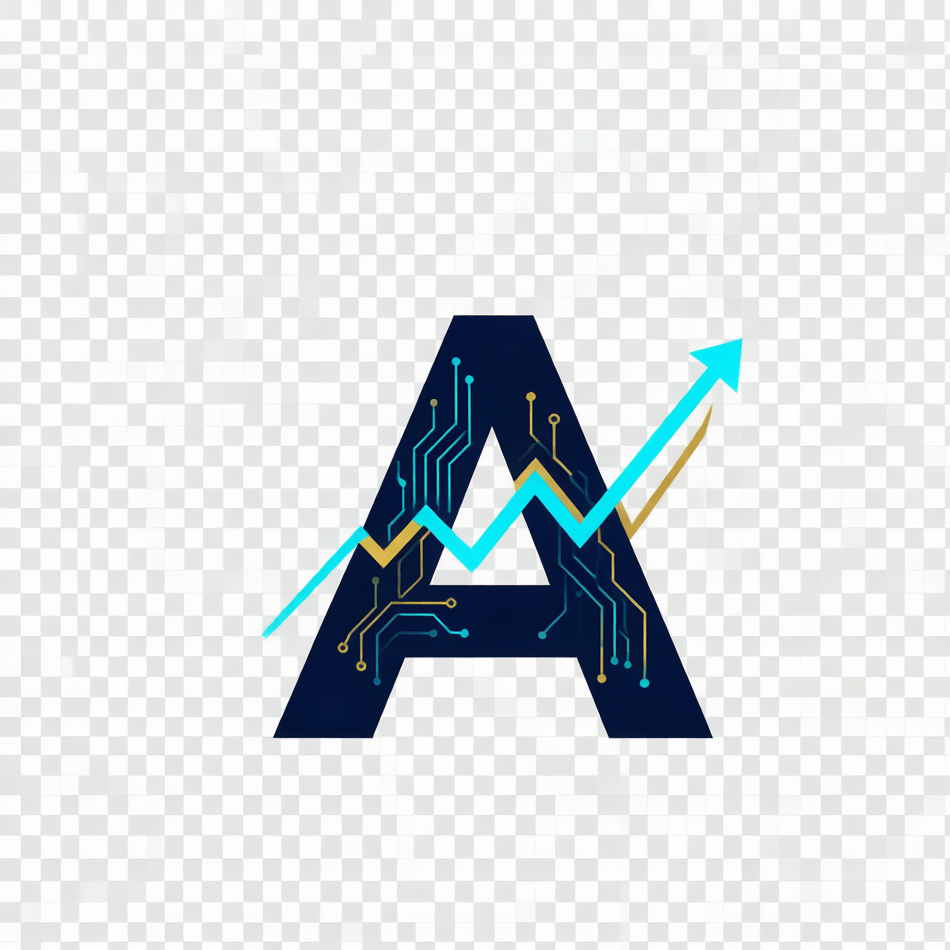

<p align="center">
  <a href="https://github.com/astockpursue/AStockPursue">
    
  </a>
</p>

<h1 align="center">AStockPursue</h1>

<p align="center">
  <strong>AI 驱动的量化研究与交易工作流平台</strong>
</p>

<p align="center">
  Go 核心承载高性能执行 · Python 层负责 AI 研究 · gRPC 桥接保持边界清晰
</p>

<p align="center">
  <a href="README.md">English</a> · <a href="CHANGELOG.md">变更日志</a> · <a href="docs/">文档</a>
</p>

<p align="center">
  
  
  
  
</p>

<p align="center">
  
  
  
  
  
  
  
</p>

---

> **免责声明**：本软件**仅供研究学习使用**，不构成任何投资建议。作者和贡献者对使用本软件所产生的任何交易损失不承担任何责任。**历史业绩不代表未来表现。**

## 为什么选择 AStockPursue？

AStockPursue 将**高性能 Go 交易引擎**与**Python AI/研究层**整合为一个统一的工作流平台。从因子筛选、自然语言生成策略，到回测验证和迭代优化，无需切换上下文。

| 你能得到的 | 它带来的价值 |
|---|---|
| ⚡ **统一的 bar-by-bar 执行管线** | 回测与实盘共用同一引擎，避免逻辑漂移 |
| 🧠 **自然语言生成策略** | 「帮我写一个沪深 300 动量策略」直接生成并回测完整 `SignalEngine` |
| 🧬 **450+ 因子 + GP 挖掘** | 内置 alpha101、gtja191、qlib158，以及进化式因子发现引擎 |
| 🎛️ **可视化工作流画布** | 10 大类共 58 种类型化节点，支持 Kahn 算法并发调度 |
| 🔌 **多券商网关** | 富途、Binance、OKX，采用可插拔网关模式 |
| 🌍 **8 种市场引擎** | A股、美股/港股、加密货币永续、外汇、中国/全球期货、期权、复合 |

## 架构设计

```
┌─────────────────────────────────────────────────────────────┐
│  前端 (Next.js 15) — 端口 5899                               │
│  REST / SSE / WebSocket                                     │
└────────────────────────────┬────────────────────────────────┘
                             │
┌────────────────────────────▼────────────────────────────────┐
│  Go 核心服务 — 端口 8899                                      │
│  ├─ HTTP API (gin) — 交易、回测、认证、行情                 │
│  ├─ 交易引擎 — on_bar() 管线，8 种市场引擎                   │
│  ├─ 行情数据 — 8 个 A股加载器、三级存储、WebSocket 推送     │
│  ├─ 券商网关 — 富途 · Binance · OKX                         │
│  ├─ 组合 / 风控 — 仓位、保证金、止损、OMS 状态机            │
│  └─ gRPC 客户端 ─────────────────┐                          │
└────────────────────────────────┼────────────────────────────┘
                                 │ gRPC + Protobuf
┌────────────────────────────────▼────────────────────────────┐
│  Python 研究层 — 端口 8900 / 8902                           │
│  ├─ MCP Server — 22 工具、89 技能、swarm 预设               │
│  ├─ 因子挖掘 — GP 进化、450+ alpha zoo                      │
│  ├─ AI Agent — ReAct 循环、记忆、11 种 LLM 提供商           │
│  ├─ 分析 — 归因、情绪、相关性                               │
│  ├─ 工作流引擎 — 25 节点类型、可视化管线                    │
│  └─ gRPC Server — factor, signal, LLM, analysis, workflow │
└─────────────────────────────────────────────────────────────┘
                             │
┌────────────────────────────▼────────────────────────────────┐
│  数据层                                                   │
│  PostgreSQL 16 · TimescaleDB · Redis 7                    │
└───────────────────────────────────────────────────────────┘
```

**设计理念**：Go 负责所有对延迟敏感的模块——执行、行情、风控；Python 负责研究密集型工作——因子挖掘、LLM Agent、工作流编排。gRPC 让边界清晰且可测试。

## 核心功能

### 🚀 交易引擎（Go）
- **回测与实盘共用同一管线** — 一个 `OnBar()` 循环，零代码重复
- **8 种市场引擎** — A股（T+1、涨跌停）、美股/港股、加密货币永续、外汇、中国期货、全球期货、期权、复合
- **风控管线** — 止损、追踪止损、止盈、日内最大亏损、持仓限制、OMS 状态机
- **多券商** — 富途（A股/港股/美股）、Binance + OKX（加密货币），可插拔网关模式
- **模拟交易** — 状态机（`创建 → 运行 → 暂停 → 停止 → 错误`），内存仓库
- **行情数据** — 多源加载器、三级存储（`缓存 → TimescaleDB → 加载器回退`）、WebSocket 实时推送

### 🧠 AI Agent（89 项技能）
- **自然语言 → 策略代码** — 描述一个想法，即可获得可回测的 `SignalEngine`
- **ReAct 循环** — 89 个技能包覆盖 A股、加密货币、期权、宏观、风控、因子分析
- **11 种 LLM 提供商** — OpenAI · Anthropic · DeepSeek · Gemini · 月之暗面 · 智谱 · Grok · Ollama · MiniMax · 通义千问 · OpenRouter

### 🧬 Alpha 工厂
- **450+ 预置因子** — alpha101（101 个）、gtja191（191 个）、qlib158（158 个）、学术因子、用户挖掘
- **GP 进化引擎** — 遗传规划 + 复合适应度（`IC × 复杂度 × 正交性`）、FDR 校正、滚动窗口验证
- **LLM 因子挖掘** — 从研报提取公式、候选人辩论、GP+LLM 混合流水线

### 🎛️ 可视化工作流引擎
- **58 种类型化节点** — 拖拽连线画布，实时类型校验
- **并发执行** — Kahn 算法 + asyncio 并行调度
- **运行时快照** — 每次运行捕获完整 DAG 状态，永远可复现

### 📊 研究工具
- **智能筛选器** — 多条件股票筛选，整合 Alpha Zoo 因子
- **业绩归因** — Brinson、因子、行业分解
- **策略对比** — 配对 t 检验、自助法、White 现实检验
- **新闻情绪** — 多源聚合，中文 NLP 评分
- **市场状态识别** — 规则型分类，含策略族推荐

### 🛡️ 平台特性
- **多用户隔离** — JWT 认证，用户级数据和券商凭证
- **定时任务** — Cron 自动回测、数据健康检查、自选股提醒
- **策略市场** — 发布、浏览、安装、评分社区策略
- **国际化** — English、简体中文、日本語、한국어

## 技术栈

| 层 | 技术 |
|---|---|
| **前端** | Next.js 15, React 19, TypeScript, Zustand, Recharts + D3, CodeMirror 6, Tailwind CSS 4, shadcn/ui |
| **Go 核心** | Go 1.22+, gin, pgx, rueidis, gRPC 客户端 |
| **Python 研究** | Python 3.11+, gRPC 服务端, PyTorch, scikit-learn, SnowNLP, pgvector, LangChain |
| **数据** | PostgreSQL 16 + TimescaleDB, Redis 7, pandas, NumPy, Parquet |
| **基础设施** | Docker Compose, JWT, SSE 流式推送, GitHub Actions CI/CD |

## 快速开始

### 完整部署
```bash
docker compose up -d --build              # Go 核心 (8899) + Python (8900/8902)
docker compose --profile pg up -d --build # 同时部署 PostgreSQL
docker compose --profile frontend up -d   # 前端开发服务器 (5899)
```

### Go 核心开发
```bash
cd services/go && go run ./cmd/server   # HTTP API + gRPC 客户端
```

### Python 研究层开发
```bash
cd services/python && pip install -r requirements.txt
python mcp_server.py                      # MCP (stdio/SSE, 端口 8900)
python -m src.grpc.server                 # gRPC 服务端 (端口 8902)
```

### 前端开发
```bash
cd frontend && npm run dev
```

### 测试
```bash
cd services/go && go test ./...                      # Go 单元测试
cd services/python && python -m pytest tests/ -x -q  # Python 测试
cd frontend && npx vitest                            # 前端测试
```

## 项目结构

```
astockpursue/
├── services/
│   ├── go/                         # Go 核心服务
│   │   ├── cmd/server/             #   入口（gin HTTP + gRPC 客户端）
│   │   ├── internal/
│   │   │   ├── api/handler/        #   REST 处理器（16 个端点）
│   │   │   ├── engine/             #   交易引擎（8 类型 + 管线 + 风控 + OMS）
│   │   │   ├── market/             #   加载器、存储、行情推送
│   │   │   ├── broker/             #   富途、Binance、OKX 网关
│   │   │   ├── portfolio/          #   仓位计算（等权 / Kelly / 风险平价）+ 保证金
│   │   │   ├── papertrade/         #   模拟交易引擎
│   │   │   └── db/                 #   PostgreSQL + TimescaleDB + Redis
│   │   └── Dockerfile
│   ├── python/                     # Python 研究层
│   │   ├── mcp_server.py           #   MCP 服务端（stdio/SSE）
│   │   ├── src/
│   │   │   ├── grpc/               #   gRPC 服务实现（6 个 service）
│   │   │   ├── factors/            #   Alpha Zoo + GP 进化引擎
│   │   │   ├── agent/              #   ReAct Agent 循环
│   │   │   ├── skills/             #   89 个技能包
│   │   │   ├── workflow/           #   可视化工作流引擎
│   │   │   ├── swarm/              #   多智能体编排
│   │   │   ├── tools/              #   MCP 工具实现
│   │   │   └── services/           #   分析、实盘桥接
│   │   ├── backtest/               #   加载器 + 数据存储（MCP 保留）
│   │   └── tests/
│   ├── proto/                      # 共享 Protobuf 定义
│   │   ├── signal.proto
│   │   ├── factor.proto
│   │   ├── llm.proto
│   │   ├── analysis.proto
│   │   ├── workflow.proto
│   │   └── data.proto
│   └── frontend/                   # Next.js 前端
│       ├── app/                    #   App Router 页面（27 页）
│       ├── components/             #   UI + 金融组件
│       ├── stores/                 #   Zustand 状态管理
│       └── lib/                    #   API 客户端、i18n、工具
├── docs/                           # 文档
├── docker-compose.yml
├── CHANGELOG.md
└── CLAUDE.md
```

## 许可证

MIT License。基于 [Vibe-Trading](https://github.com/HKUDS/Vibe-Trading) (HKUDS, MIT License) 二次开发。
