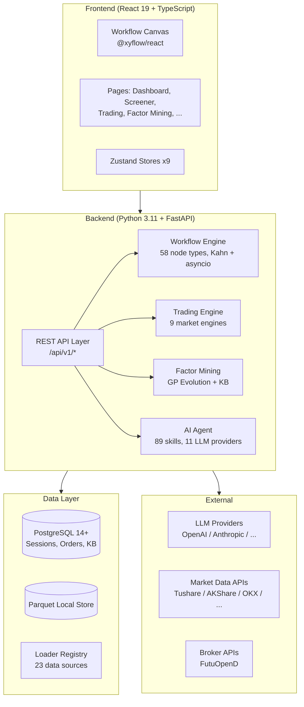
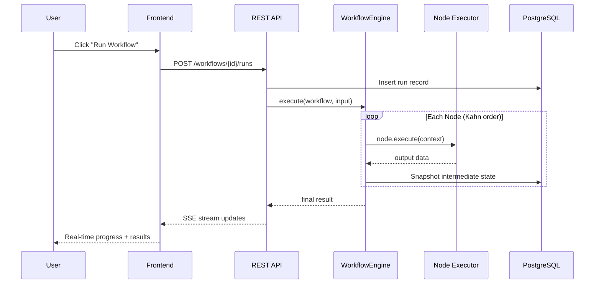
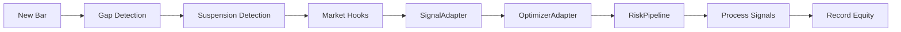
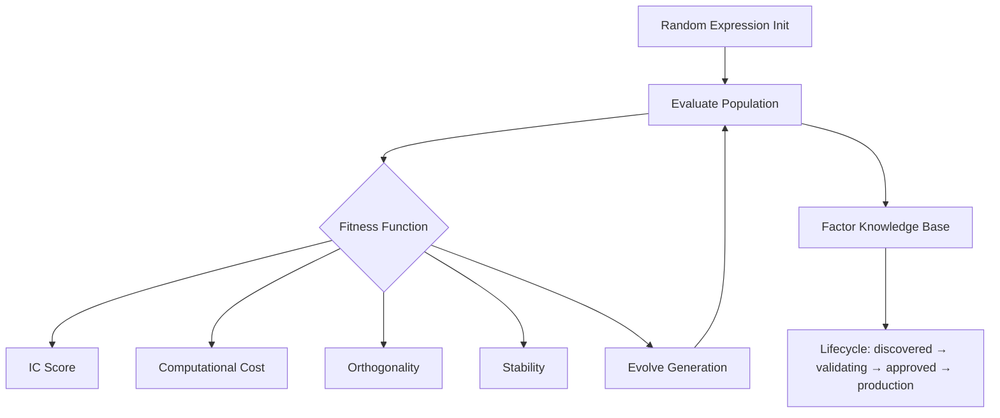
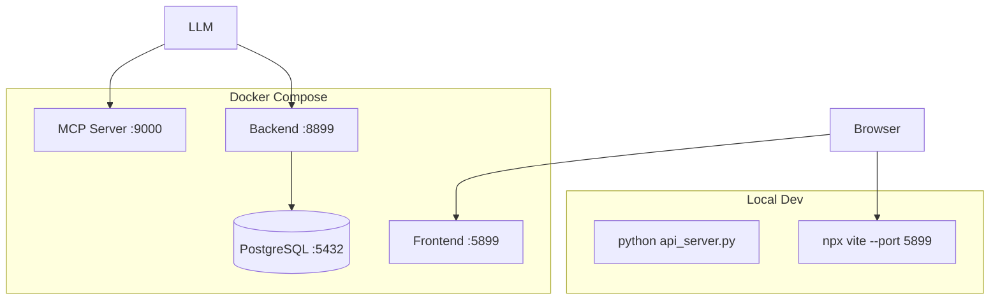

# Architecture Overview

AStockPursue is an n8n-style visual workflow platform for quantitative research, with 9 market engines, 450+ factors, 89 AI skills, and 58 workflow node types.

## System Layers



## Backend Package Map

```
backend/
├── api_server.py            # FastAPI entry point (port 8899)
├── mcp_server.py            # MCP server (stdio / SSE :8900)
├── cli.py                   # Interactive CLI
├── backtest/                # Backtesting core
│   ├── data_store.py        # 3-tier data access (PG → Parquet → Loader)
│   ├── engines/             # 9 market engines (A-share, US, HK, crypto, forex, futures, options, composite)
│   ├── loaders/             # 23 self-registering data source loaders
│   ├── metrics.py           # Sharpe, Sortino, Calmar, max drawdown, etc.
│   └── runner.py            # Backtest orchestrator
├── src/
│   ├── api/                 # Route handlers (REST endpoints)
│   ├── agent/               # LLM agent loop
│   ├── auth/                # JWT auth, PBKDF2, user config
│   ├── db/                  # Connection pool (psycopg2), async wrapper
│   ├── factors/             # Factor mining (GP engine, KB, registry, safety validator)
│   ├── lab/                 # Strategy lab (backtest bridge, storage, templates)
│   ├── skills/              # 89 AI skill packs (SKILL.md + examples)
│   ├── trading/             # Trading engine, risk pipeline, signal adapter
│   ├── workflow/            # Workflow engine, 58 node types, templates
│   └── tools/               # MCP tools, background tools, research tools
└── tests/                   # 100+ test files (unit / integration / slow markers)
```

## Data Flow: Workflow Execution



## Trading Engine Pipeline

The unified `TradingEngine.on_bar()` processes every bar through the same pipeline for both backtest and live trading:



**Critical ordering**: `_record_bars()` must run AFTER `_generate_signals()` to prevent look-ahead bias.

## Factor Mining Pipeline



## Deployment Topology



## Key Design Decisions

| Decision | Rationale |
|----------|-----------|
| 3-tier data access (PG → Parquet → Loader) | Cache hot data in PG, warm in Parquet, cold fetch from APIs. 8-source A-share fallback for reliability. |
| SignalAdapter dual-mode (tick + batch) | Tick mode for live trading efficiency; batch mode for backtest accuracy with look-ahead prevention. |
| GP evolution with FDR correction | Benjamini-Yekutieli for correlated tests (not BH). Non-overlapping walk-forward windows ensure OOS IC independence. |
| Self-registering loaders | Each data source declares `is_available()` with real connectivity check, not just `import`. |
| FactorKB SHA256 dedup | Identity is `formula_hash` (canonical), never `formula` (display string varies with commutative ops). |
| Single-threaded backtest | `_active_symbol` shared state is safe by design. Each engine has its own market instance. |
